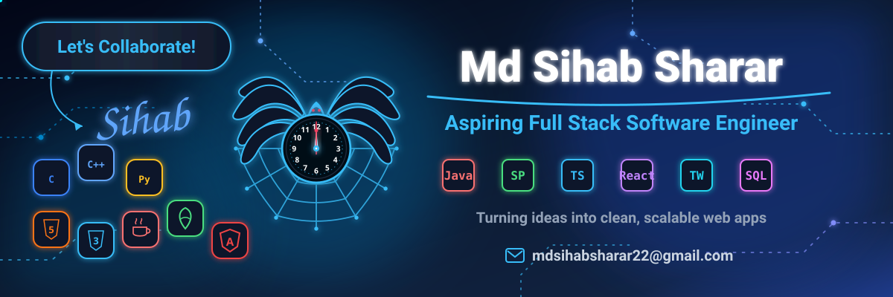

## 👨‍💻 About Me

I'm a passionate developer focused on **Java & Spring Boot backend development**
and modern **frontend development**.

- 🌱 Currently improving my skills in **React and TypeScript**
- ⚙️ Building backend applications with **Java & Spring Boot**
- 🎨 Creating responsive UIs with **React & Tailwind CSS**
- 🗄️ Working with **MySQL** for database-driven applications
- 🔧 Using **Git & GitHub** for version control
- 💡 Love learning new technologies and solving programming problems

  

## 🛠️ Tech Stack

  

  

## 🧩 Programming Sites

  

## 📫 Connect With Me

  

## 🔥 Daily Streak
<!-- 🔥 GitHub Daily Streak Section -->

   
  

    
  

   

  

 

👀 Profile Views

  

